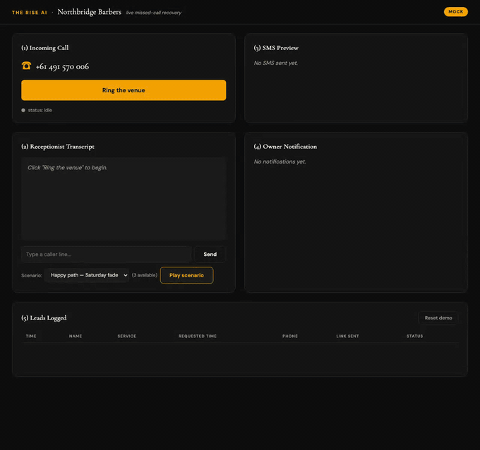

# AI Receptionist Lab

A runnable lab for an AI phone receptionist that answers a small venue's missed
and after-hours calls, captures the booking enquiry, texts the caller a booking
link, and notifies the owner — without asking the venue to change booking
systems.

**Status.** The mock demo runs with zero credentials. The voice + calendar path
was integrated live once against a real barbershop's calendar (2026-08-21;
the venue is anonymised throughout this repo). **There are no production
callers, and there has never been a pilot.** See [`CLAIMS.md`](./CLAIMS.md) for
what is measured, what is verified, and what is simply unknown.



## Quickstart

```bash
make install     # creates .venv, installs pinned deps
make demo        # uvicorn on :8000
```

Open <http://localhost:8000/demo>. Mock mode is the default and needs **no API
keys and no `.env`**. Click **Ring the venue**, then **Play scenario**, and the
whole journey plays out in one page: the call comes in, the transcript streams,
an SMS card appears with the booking link, the owner-notification card lights
up, and a lead row lands in the table.

```bash
make test        # 20 tests, no credentials required
make lint        # ruff over the repo + mypy --strict on the adapter ABCs
```

## What's in here

| Path | What it is |
|---|---|
| `main.py` | FastAPI app: `/demo`, `/ring`, `/turn`, `/events` (SSE), `/leads`, `/reset` |
| `state_handler.py` | The conversation state machine — capture targets, reprompt budget, handoff |
| `agents/receptionist_agent.py` | Gemini brain, tool-calling for field capture |
| `agents/extractors.py` | Deterministic extraction (phone, time, service) that runs before the model |
| `adapters/` | Three ABCs — `SMSAdapter`, `NotifyAdapter`, `StoreAdapter` — with mock and live implementations behind a factory |
| `venues/` | Per-venue YAML: name, phone, services, hours, booking link, timezone |
| `prompts/receptionist_system.md` | Single source of truth for the receptionist persona — both the Gemini brain and the voice agent are wired to it |
| `agents/elevenlabs/barber-agent-config.json` | The voice-agent config, including the five tool definitions |
| `n8n/barber-demo-handle-agent-tools.json` | The 76-node n8n workflow backing those five tools against a calendar API |
| `docs/verification-2026-08-21.md` | The live-integration verification log, claim-labelled |
| `docs/runbook-live-pilot.md` | How to wire the live path yourself |

## Architecture

A single FastAPI process serves the demo page and drives the conversation. All
I/O sits behind three adapter ABCs, so mock and live wiring are
interchangeable and the state machine never knows which is in use.

```
browser  ──/ring, /turn──►  FastAPI  ──►  state_handler  ──►  Gemini brain
   ▲                           │                                   │
   └────── SSE /events ────────┤                                   ▼
                               ├──► SMSAdapter     (mock | twilio)
                               ├──► NotifyAdapter  (mock | ghl | email)
                               └──► StoreAdapter   (json)
```

The voice path is separate and optional: a hosted voice agent calls five
webhook tools on an n8n workflow, which talks to a calendar API. That workflow
is exported here with every credential, workflow and webhook ID replaced by a
placeholder.

### Two bugs that only appeared live

Both are the reason this repo exists as a lab rather than a slide.

1. **The agent didn't know what day it was.** Asked to book "tomorrow", it
   resolved to a date in the past — the prompt had no grounding for "today".
   The backend behaved correctly and returned no slots; the agent was simply
   wrong. Fixed by injecting the platform's `{{system__time}}` variable into
   the prompt with an explicit instruction to resolve relative dates against
   it.
2. **A transient `401` on parallel fan-out.** `find_appointment` fans out one
   detail request per calendar event. One of five near-simultaneous requests
   intermittently returned `401 "Command timed out"` from the provider — the
   other four, same credential, succeeded. The symptom was a booking that
   "didn't exist". Fixed with `retryOnFail: true, maxTries: 3,
   waitBetweenTries: 400` on all 15 calendar-calling HTTP nodes.

Neither is exotic. Neither was catchable with mocks.

## Modes

| Mode | Needs | Behaviour |
|---|---|---|
| **MOCK** (default) | nothing | Deterministic scripted replies, mock SMS card, mock owner-notify card, `data/leads.json` sink |
| **LIVE** | `GEMINI_API_KEY`, optionally `GHL_*` / `SMTP_*` / `PUBLIC_BASE_URL` | Real model replies, real CRM contact + opportunity, real email, webhook-fronted flow |

Every knob is documented in [`.env.example`](./.env.example). Copy it to `.env`
and fill in only what the mode you want requires. Useful ones:

- `VENUE_CONFIG_PATH` — which venue YAML to load (default
  `venues/northbridge-barbers.yaml`).
- `SMS_ADAPTER` — `mock` (default) or `twilio`.
- `NOTIFY_ADAPTER` — comma-separated, e.g. `mock,ghl,email`.
- `STORE_ADAPTER` — `json`.
- `MONTHLY_FEE` — your own fee, for the worksheet below. Nothing in the demo
  runtime reads it; it has no default, and this repo publishes no price.

## How this would be measured

The lab has an opinion about how a receptionist like this should be sold, and
it is not "trust the demo":

1. **Audit first, for 14 days.** Count the venue's actual missed and
   after-hours calls before anything is installed. That number is the only
   honest baseline.
2. **Set a 2× gate.** Estimated recovered value must clear twice the monthly
   fee (`MONTHLY_FEE`) using the venue's own average booking value and its own
   measured missed-call volume — not an industry average.
3. **Say "don't buy" when it doesn't clear.** A venue with four missed calls a
   fortnight does not need this. Saying so is the point of measuring.

No conversion rate, recovered-revenue figure, or ROI is claimed anywhere in
this repository, because none has been measured.

## What this is not

- Not a provisioned phone product — there is no telephony number on the
  inbound leg in the default configuration.
- Not multi-tenant — one venue at a time, via `VENUE_CONFIG_PATH`.
- Not a booking engine — the mock flow sends a booking link; the optional live
  path reserves slots through an external calendar API.
- Not production-hardened — no auth, no rate limiting, single-process SSE bus,
  no load testing of any kind.

## Further reading

- [`CLAIMS.md`](./CLAIMS.md) — every number in this repo, and its class.
- [`USAGE.md`](./USAGE.md) — the field guide: four ways to drive it, and the
  open loose ends.
- [`docs/verification-2026-08-21.md`](./docs/verification-2026-08-21.md) — the
  live-integration log.
- [`docs/runbook-live-pilot.md`](./docs/runbook-live-pilot.md) — wiring the
  live path.

## Licence

MIT — see [`LICENSE`](./LICENSE).
